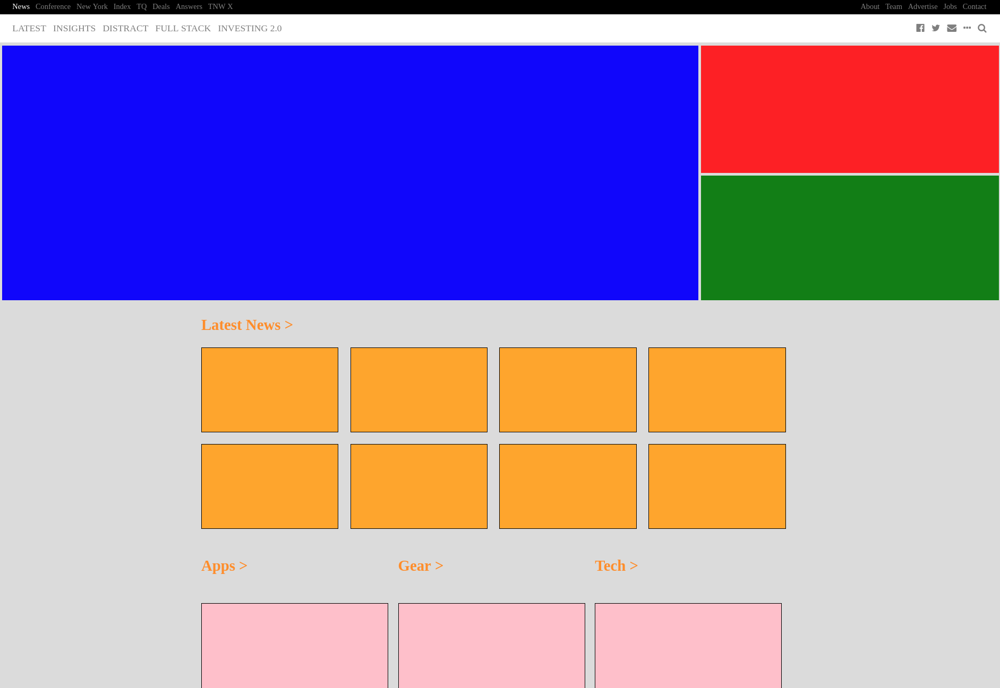

# Responsive Design Project

This purpose of this project was to practice implementing responsive design by creating [The Next Web's homepage](https://thenextweb.com).

This is a project from [The Odin Project](https://www.theodinproject.com/courses/html5-and-css3/lessons/building-with-responsive-design).

## Pre-Project Thoughts

No particular thoughts going in.

## Post-Project Thoughts

This was very good for getting my hands dirty with flexbox. I definitely saw its power compared to positioning/floats. I had to wean myself off of that, and I feel like I have a lot of room to grow.
